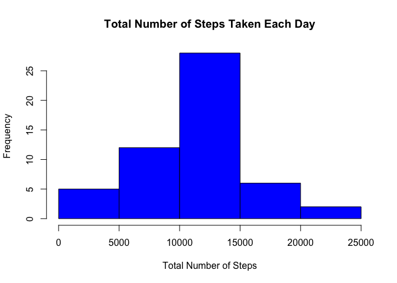
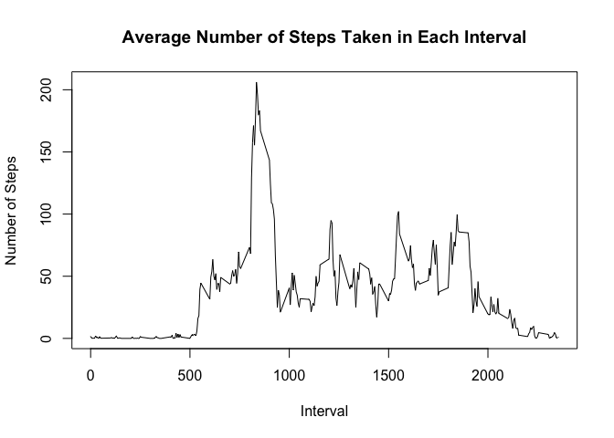
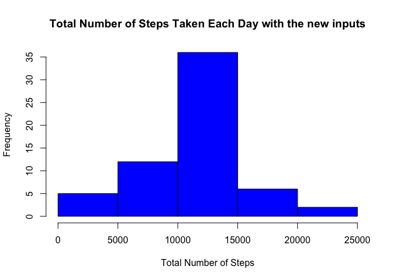
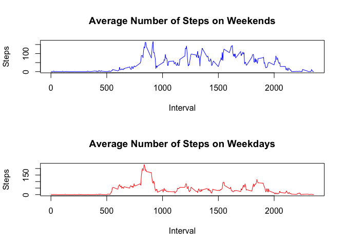

# Reproducible Research Course Project-1


### Downloading and unzipping the data
Create a folder named 'downloads' and save the zip file as project.zip

```r
fileUrl <- "https://d396qusza40orc.cloudfront.net/repdata%2Fdata%2Factivity.zip"
if (!file.exists("./downloads")){dir.create("./downloads")}
if (!file.exists("./downloads/project.zip")){download.file(fileUrl, destfile="./downloads/project.zip", method="curl")}
if (!file.exists("./downloads/activity.csv")){unzip(zipfile="./downloads/project.zip", exdir="./downloads/")}
```

### Loading and preprocessing the data

```r
raw_data <- read.csv(file="./downloads/activity.csv")
activity <- raw_data
```

Change the class of the date column to Date

```r
activity$date <- as.Date(activity$date)
```

Remove NA

```r
activity <- na.omit(activity)
```

### What is mean total number of steps taken per day?
Aggregate the total number of steps for each day

```r
steps_by_day <- aggregate(steps ~ date, activity, sum)
```

Histogram of the total number of steps taken each day

```r
hist(steps_by_day$steps, col = "blue", xlab = "Total Number of Steps", ylab = "Frequency", main = "Total Number of Steps Taken Each Day")
```

<!-- -->

Change steps column to numeric

```r
steps_by_day$steps <- as.numeric(steps_by_day$steps)
```

Display Mean of Total Number of Steps Taken per Day

```r
mean_steps <- mean(steps_by_day$steps)
paste("The Mean of Total Number of Steps Taken per Day is", mean_steps)
```

```
## [1] "The Mean of Total Number of Steps Taken per Day is 10766.1886792453"
```

Display Median of Total Number of Steps Taken per Day

```r
median_steps <- median(as.numeric(steps_by_day$steps))
paste("The Median of Total Number of Steps Taken per Day is", median_steps)
```

```
## [1] "The Median of Total Number of Steps Taken per Day is 10765"
```

### What is the average daily activity pattern?

```r
steps_by_interval <- aggregate(steps ~ interval, activity, mean)
plot(steps_by_interval$interval,steps_by_interval$steps, type="l", xlab="Interval", ylab="Number of Steps",main="Average Number of Steps Taken in Each Interval")
```

<!-- -->

The 5-minute interval, which contains the maximum number of steps

```r
internal_maxstep <- steps_by_interval$interval[which.max(steps_by_interval$steps)]
paste("The 5-minute interval, which contains the maximum number of steps is", internal_maxstep)
```

```
## [1] "The 5-minute interval, which contains the maximum number of steps is 835"
```

### Imputing missing values
Display the number of missing values

```r
num_missing_values <- sum(is.na(raw_data$steps))
paste("The number of missing values in the dataset is", num_missing_values)
```

```
## [1] "The number of missing values in the dataset is 2304"
```

**Strategy:** We can use five minutes interval's mean for the missing values

```r
missing_values <- is.na(raw_data$steps)
mean_int <- tapply(raw_data$steps, raw_data$interval, mean, na.rm=TRUE)
raw_data$steps[missing_values] <- mean_int[as.character(raw_data$interval[missing_values])]
```

Total Number of Steps Taken Each Day

```r
steps_by_day_new <- aggregate(steps ~ date, raw_data, sum)
```

Histogram of the total number of steps taken each day after missing values are imputed

```r
hist(steps_by_day_new$steps, col = "blue", xlab = "Total Number of Steps", ylab = "Frequency", main = "Total Number of Steps Taken Each Day with the new inputs")
```

<!-- -->

### Are there differences in activity patterns between weekdays and weekends?
Change steps column to numeric

```r
steps_by_day_new$steps <- as.numeric(steps_by_day_new$steps)
```

Mean of Total Number of Steps Taken per Day with the new inputs

```r
mean_steps_new <- as.integer(mean(steps_by_day_new$steps))
paste("The Mean of Total Number of Steps Taken per Day with the new imputs is", mean_steps_new)
```

```
## [1] "The Mean of Total Number of Steps Taken per Day with the new imputs is 10766"
```

Median of Total Number of Steps Taken per Day using the new inputs

```r
median_steps_new <- as.integer(median(as.numeric(steps_by_day_new$steps)))
paste("The Median of Total Number of Steps Taken per Day with the new inputs is", median_steps_new)
```

```
## [1] "The Median of Total Number of Steps Taken per Day with the new inputs is 10766"
```

Difference between the old and the new inputted tables steps means

```r
mean_diff <- mean_steps - mean_steps_new
paste("Difference between the old and the new inputted tables steps means is", mean_diff)
```

```
## [1] "Difference between the old and the new inputted tables steps means is 0.188679245282401"
```

Difference between the old and the new inputted tables steps medians

```r
median_diff <- median_steps - median_steps_new
paste("Difference between the old and the new inputted tables steps means is", median_diff)
```

```
## [1] "Difference between the old and the new inputted tables steps means is -1"
```
We can say that the new mean with the inputted data is lower than the previous mean.
Also the new median with the inputted data is higher than the previous median.

Create a new dataframe from the row data

```r
new_data <- raw_data
```

Change the date column to date class

```r
new_data$date <- as.Date(new_data$date)
new_data$days <- weekdays(new_data$date)
```

Add a new column for day type (weekend or weekdays) for the new dataframe

```r
new_data$daytype <- ifelse (new_data$days %in% c("Saturday", "Sunday"), "weekend", "weekdays")
```

Create a mean daytype steps

```r
mean_steps_by_daytype <- aggregate(steps ~ interval + daytype, new_data, mean)
names(mean_steps_by_daytype)[3] <- "Mean_Steps"
```

Subset the dataframe for weekdays and weekend daytype

```r
mean_weekday <- subset(mean_steps_by_daytype, daytype == "weekdays")
mean_weekend <- subset(mean_steps_by_daytype, daytype == "weekend")
```

Panel plot comparing the average number of steps taken per 5-minute interval across weekdays and weekends

```r
par(mfrow=c(2,1))
plot(mean_weekend$interval, mean_weekend$Mean_Steps, type="l", col = "blue", ylab = "Steps", xlab = "Interval", main = "Average Number of Steps on Weekends")
plot(mean_weekday$interval, mean_weekday$Mean_Steps, type="l", col = "red", ylab = "Steps", xlab = "Interval", main = "Average Number of Steps on Weekdays")
```

<!-- -->
